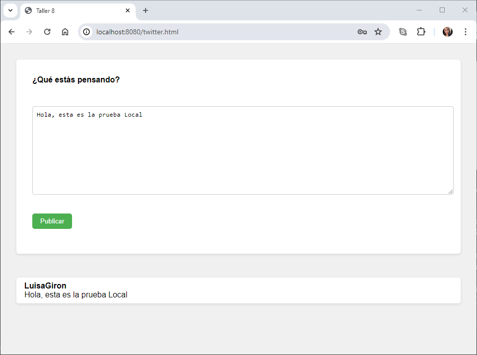
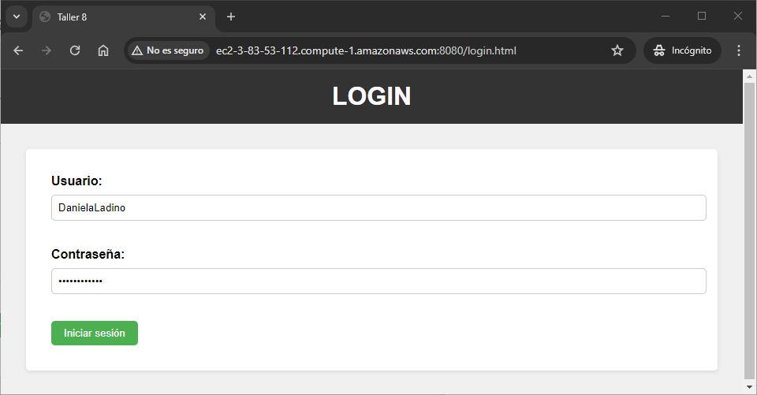
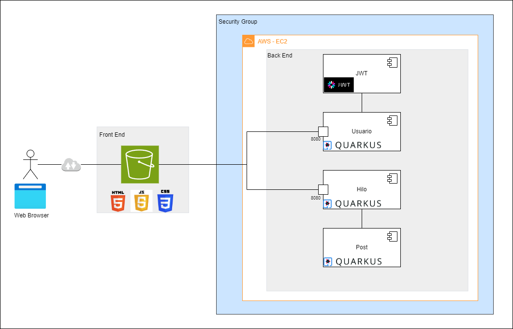

# TALLER 8 : Microservicios

Se creo una aplicación web usando el framework Quarkus (https://quarkus.io/). La cual fue desplegada en AWS utilizando los servicios de EC2 y S3.

Esta aplicación le permite a los usuarios hacer posts de 140 caracteres e ir registrándolos en un stream único de posts (similar a Twitter). En donde se tuvieron en cuenta tres entidades Usuario, hilo(stream) y posts.

---
### Prerrequisitos

* [Maven](https://maven.apache.org/)

* [Git](https://learn.microsoft.com/es-es/devops/develop/git/what-is-git)

* [Java -17](https://www.cursosaula21.com/que-es-java/)

* [AWS](https://aws.amazon.com/es/training/awsacademy/)

* [Quarkus](https://es.quarkus.io/about/)

---

### Instalación y Ejecución

1.Clonamos el repositorio

```
https://github.com/20042000/AREP_Taller08.git
```

2.Ingresamos a la carpeta del repositorio que clonamos anteriormente

```
cd AREP_Taller08
```

3.Contruimos el proyecto

```
mvn package
```

4.Levantamos el servidor

```
mvn quarkus:run
```
---

### Usabilidad

Nuestra aplicación consta de dos formulario uno es el login y el otro es nuestra aplicación similar a twitter donde los usuarios podran realizar los post que se iran registrando en un hilo único de posts.

**Importante:** Si un usuario no esta logueado, no puede acceder a la página principal

1.Probamos nuestra aplicación accediendo a la siguiente URL en el navegador

```
http://localhost:8080/login.html
```

Allí vamos a loguearnos con uno de nuestros usuarios, con el username y la contraseña, como se muestar a continuación:


**Nota:** Puede ingresar con los siguientes usuarios:

```
Usuario: LuisaGiron
Contraseña: Luisa05-25

Usuario: FelipeLadino
Contraseña: Felipe11-20

Usuario: DanielaLadino
Contraseña: Daniela20-04

```
Si ingresamos con las credenciales correctas se abrirá la página principal de la aplicación, en donde el usuario ingresará un comentario en el campo de texto y luego debe dar click en publicar.

Luego de que el usuario publique el post, este aparecerá en una lista, como se muestra a continuación:




Ahora vamos a ingresar con otro usuario desde una ventana incognito para postear otro mensaje


Como podemos observar, aparecen dos posts uno del usuario Luisa y otro del usuario Felipe el cual se agregó a nuestro hilo. 

Es importante tener en cuenta que, si el usuario de Luisa recarga la pagina o envía otro post, este también podrá visualizar los posts que hayan realizado otros usuarios.


---
### Ejecución de Test
```
mvn test
```

---
### Despliegue en AWS

En el siguiente link encontrara el video donde se evidencia el despliegue en AWS:

```
https://youtu.be/R3PjA0yoG9s
```

---

### Pruebas Despliegue en AWS

**EC2:**


Probamos nuestra aplicación accediendo a la siguiente URL en el navegador

```
http://ec2-3-83-53-112.compute-1.amazonaws.com:8080/login.html
```

Ingresamos con el usuario LuisaGiron


Realizamos un Post, como se muestra a continuación:


Ahora ingresamos con el usuario DanielaLadino en una ventana incognito



Realizamos un Post con el usuario DanielaLadino:


Como podemos observar se listaron 2 post los cuales son: el post realizado por LuisaGiron y el post realizado por DanielaLadino.


**S3:**

Probamos nuestra aplicación accediendo a la siguiente URL en el navegador

```
http://twitter-statics.s3-website-us-east-1.amazonaws.com/login.html
```

Ingresamos con el usuario FelipeLadino


Realizamos un Post, como se muestra a continuación:


Ahora ingresamos con el usuario LuisaGiron en una ventana incognito


Realizamos un Post con el usuario DanielaLadino:


Como podemos observar se listaron 2 post los cuales son: el post realizado por LuisaGiron y el post realizado por DanielaLadino.

---
### Arquitectura

Se construyo una aplicación, similar a Twitter que permite a los usuarios publicar mensajes y ver un flujo de publicaciones. La arquitectura se compone de tres niveles principales:

**1. Front-End:** Este nivel está implementado utilizando HTML, CSS y JavaScript y se almacena en un Bucket S3, que es un servicio de almacenamiento ofrecido por AWS que se usa frecuentemente para alojar contenido estático.

**2. Back-End:** Se implemento utilizando Quarkus y consta de tres microservicios:

* **Usuario:** Este microservicio gestiona actividades de administración de usuarios, como agregar un usuario, consultar usuarios por id y loguearse.

* **Hilo:** Este microservicio gestiona actividades de administración de hilos, como agregar hilos, consultar todos los hilos, consultar un hilo por el id y agregar posts al hilo.

* **Post:** Este microservicio gestiona actividades de administración de post, como consultar los posts.

**3. JWT:** Se utiliza para autenticar usuarios

* Cuando un usuario inicia sesión, el microservicio Usuario genera un JWT.
* El JWT se envía de vuelta al front-end en la respuesta HTTP.
* Las solicitudes posteriores del front-end a los microservicios back-end incluyen el JWT en el encabezado de la solicitud.
* Los microservicios back-end validan el JWT antes de procesar la solicitud.



---

### Construido con

* [Maven](https://maven.apache.org/): Es una herramienta de comprensión y gestión de proyectos de software. Basado en el concepto de modelo de objetos de proyecto (POM), Maven puede gestionar la construcción, los informes y la documentación de un proyecto desde una pieza de información central.

* [Git](https://learn.microsoft.com/es-es/devops/develop/git/what-is-git): Es un sistema de control de versiones distribuido, lo que significa que un clon local del proyecto es un repositorio de control de versiones completo. Estos repositorios locales plenamente funcionales permiten trabajar sin conexión o de forma remota con facilidad.

* [GitHub](https://platzi.com/blog/que-es-github-como-funciona/): Es una plataforma de alojamiento, propiedad de Microsoft, que ofrece a los desarrolladores la posibilidad de crear repositorios de código y guardarlos en la nube de forma segura, usando un sistema de control de versiones llamado Git.

* [Java -17](https://www.cursosaula21.com/que-es-java/): Es un lenguaje de programación y una plataforma informática que nos permite desarrollar aplicaciones de escritorio, servidores, sistemas operativos y aplicaciones para dispositivos móviles, plataformas IoT basadas en la nube, televisores inteligentes, sistemas empresariales, software industrial, etc.

* [JavaScript](https://universidadeuropea.com/blog/que-es-javascript/): Es un lenguaje de programación de scripts que se utiliza fundamentalmente para añadir funcionalidades interactivas y otros contenidos dinámicos a las páginas web.

* [HTML](https://aulacm.com/que-es/html-significado-definicion/): Es un lenguaje de marcado de etiquetas que se utiliza para crear y estructurar contenido en la web. Este lenguaje permite definir la estructura y el contenido de una página web mediante etiquetas y atributos que indican al navegador cómo mostrar la información.

* [Visual Studio Code](https://openwebinars.net/blog/que-es-visual-studio-code-y-que-ventajas-ofrece/): Es un editor de código fuente desarrollado por Microsoft. Es software libre y multiplataforma, está disponible para Windows, GNU/Linux y macOS.

* [AWS](https://aws.amazon.com/es/training/awsacademy/): Ofrece cursos y recursos de aprendizaje que permiten a los estudiantes desarrollar diferentes habilidades relacionadas con la nube de AWS.

* [Quarkus](https://es.quarkus.io/about/): Quarkus fue creado para permitir a los desarrolladores de Java crear aplicaciones para un mundo moderno y nativo de la nube. Quarkus es un marco Java nativo de Kubernetes adaptado a GraalVM y HotSpot, elaborado a partir de las mejores bibliotecas y estándares Java. El objetivo es convertir a Java en la plataforma líder en Kubernetes y entornos sin servidor, al tiempo que ofrece a los desarrolladores un marco para abordar una gama más amplia de arquitecturas de aplicaciones distribuidas.


## Autores

* **[Luisa Fernanda Bermudez Giron](https://www.linkedin.com/in/luisa-fernanda-berm%C3%BAdez-gir%C3%B3n-b84001262/)** - [LuisaGriron](https://github.com/LuisaGiron)

* **[Jefer Alexis González Romero](https://www.linkedin.com/in/alexisgr117/)** - [AlexisGR117](https://github.com/AlexisGR117)

* **[Karol Daniela Ladino Ladino](https://www.linkedin.com/in/karol-daniela-ladino-ladino-55164b272/)** - [20042000](https://github.com/20042000)


## Licencia
**©** Luisa Fernanda Bermudez Giron. Estudiante de Ingeniería de Sistemas de la Escuela Colombiana de Ingeniería Julio Garavito

**©** Jefer Alexis González Romero. Estudiante de Ingeniería de Sistemas de la Escuela Colombiana de Ingeniería Julio Garavito

**©** Karol Daniela Ladino Ladino. Estudiante de Ingeniería de Sistemas de la Escuela Colombiana de Ingeniería Julio Garavito

